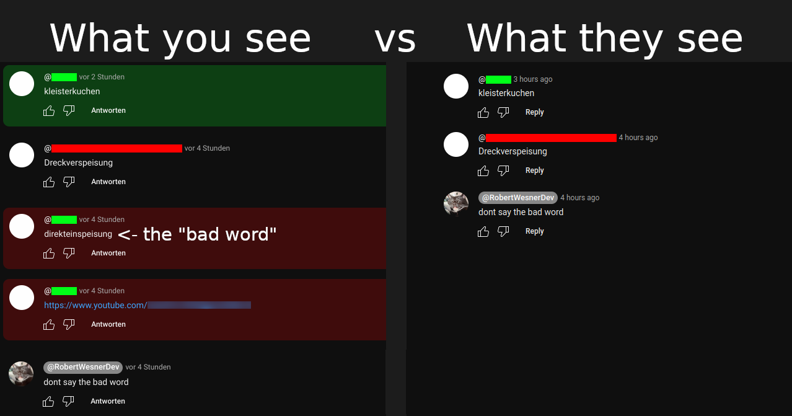

    <h1>YouTube Shadow Comment</h1>
    

        Checks if your comments are visible to the public
    

---

Due to automatic filters on YouTube, your comment may show up to you but be entirely invisible to the public.

## Installation

1. Install a userscript manager. For example, [Tampermonkey](https://www.tampermonkey.net/):
   - [Firefox](https://addons.mozilla.org/en/firefox/addon/tampermonkey/) 
   - [Chrome](https://chrome.google.com/webstore/detail/tampermonkey/dhdgffkkebhmkfjojejmpbldmpobfkfo) 
   - [Edge](https://microsoftedge.microsoft.com/addons/detail/tampermonkey/iikmkjmpaadaobahmlepeloendndfphd) 
   - [Opera](https://addons.opera.com/en/extensions/details/tampermonkey-beta/) 

2. Install this userscript by clicking [this link](../../raw/main/script.user.js).

## Usage

Your comments will be automatically checked for visibility.
If visible, they will be marked with a green background.
Invisible comments are red.

## License

This project is licensed under the [MIT License](../../raw/main/LICENSE.txt).
